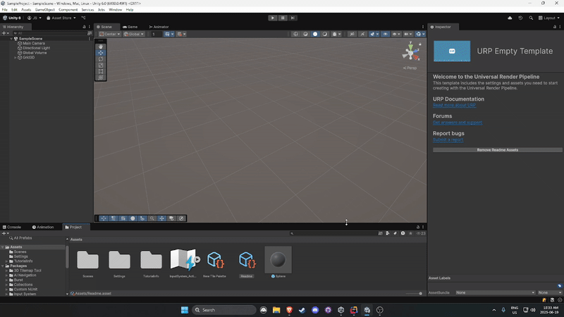
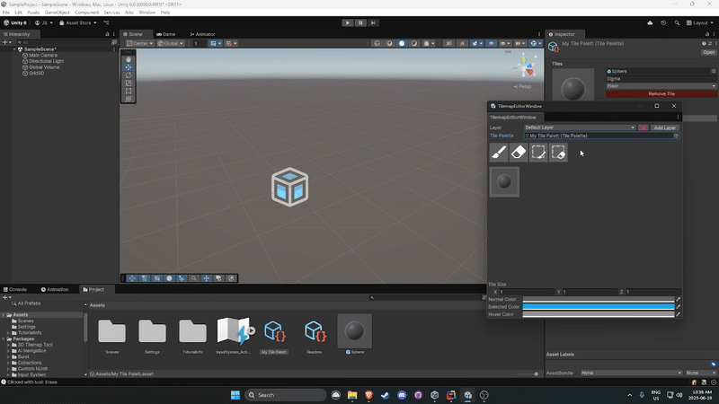
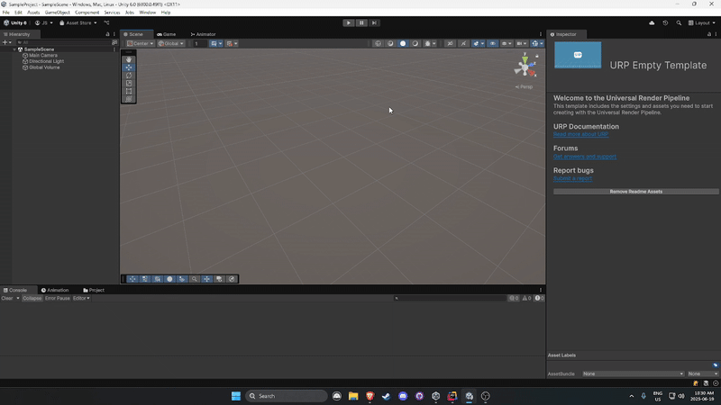

# 3D Tilemap Tool

A Unity Editor tool for placing 3D tiles, prefabs, and trigger tiles on a custom tilemap grid.

---

## 🎮 Features

- Tile palette with preview thumbnails
- 3D tile placement and deletion
- 3D tile GROUP placement and deletion
- Layer selection, creation, and deletion
- Cross-session Saving
- Prefab support

---

## 🧠 How It Works

1. Open the tilemap window via `Jobs > 3D Tilemap Tool`.
2. Create a Grid
3. Select a Tile Palette
4. Select a tile from the palette.
5. Click in the scene to place it.
6. Use the eraser or undo to remove/move tiles.

---

## 📸 How To Use

- Using The Tile Palette Scriptable Object



- Placing and Erasing Tiles


- Box Placing and Erasing Tiles



- Creating New Layers


---

## 🔧 Installation

1. Clone this repo into your Unity project's `Assets/Editor/` folder:
   git clone
   ```bash
   https://github.com/thejoeman23/3D-Tilemap-System.git
   ```
   
